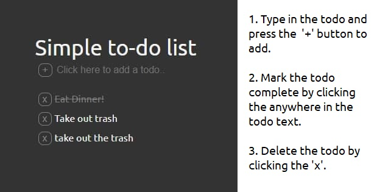

# Simple to-do app

 ### A simple & minimalistic version of the venerable to-do app. 

#### Check it out [here](https://btarro.github.io/todo-app)

 

## Summary
This right-of-passage todo project was built with a simple and clean aesthetic in mind. It leverages basic HTML, CSS(flexbox), and JavaScript. 

## Author
Bruce Tarro - Aspiring Software Developer [LinkedIn](https://www.linkedin.com/in/bruce-tarro/) | Personal Website - Comming Soon!
